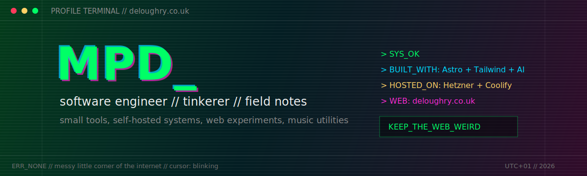

<p align="center">
  
</p>

<p align="center">
  <a href="https://deloughry.co.uk"></a>
  <a href="https://x.com/dr_dinomight"></a>
  <a href="https://bsky.app/profile/matt.deloughry.co.uk"></a>
</p>

```text
> booting profile
> sys: ok
> operator: Matthew Peck-Deloughry
> mode: software engineer / tinkerer / field-notes person
```

I build small, useful tools and write field notes from my messy little corner of the internet. Most of what turns up here sits somewhere between practical developer workflow, self-hosted systems, web experiments, music tools, and the occasional deliberately over-engineered side quest.

## ./currently

```text
SYS_OK        shipping tools that make local development less annoying
FIELD_NOTES   TDD, AI-assisted development, web plumbing, rough edges
INFRA          Hetzner + Coolify + personal systems that earn their keep
MOTTO          keep the web weird, inspectable, and mine
```

## ./projects

| repo | signal |
| --- | --- |
| [farward](https://github.com/mdeloughry/farward) | Interactive SSH port-forwarding dashboard for remote Docker and standalone services. |
| [page-xerox](https://github.com/mdeloughry/page-xerox) | Generate AI-ready Markdown from HTML pages at build time or through SSR middleware. |
| [spillover](https://github.com/mdeloughry/spillover) | Search, match, and save tracks to Spotify from links, playlists, or text lists across music platforms. |
| [ssh-setup](https://github.com/mdeloughry/ssh-setup) | Opinionated Git setup for 1Password SSH commit signing, sane defaults, and handy aliases. |

## ./field-notes

I write at [deloughry.co.uk](https://deloughry.co.uk), mostly about code, tools, experiments, AI-assisted workflows, and the parts of building software that do not fit neatly into a commit message.

```text
GITHUB=https://github.com/mdeloughry
WEB=https://deloughry.co.uk
X=https://x.com/dr_dinomight
BLUESKY=https://bsky.app/profile/matt.deloughry.co.uk
```
